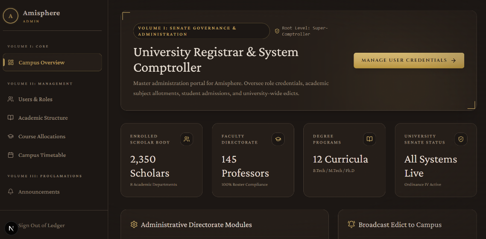

# 🏛️ Amisphere • Classical University Portal



> **Volume I • Scholarly & Executive University Architecture**  
> *Inspired by the Amizone Ecosystem of Amity University, engineered with state-of-the-art full-stack reactive architecture, classical aesthetics, and complete multi-role statutory authorization.*

---

## 🌟 Executive Summary & Overview

**Amisphere** is an enterprise-grade, comprehensive university portal designed to manage the entire statutory academic lifecycle across four distinct governance tiers: **Students**, **Faculty Instructors**, **Heads of Department (HOD)**, and **University Senate / System Comptroller (Admin)**. 

Reimagined with our signature **Academia / Classical Scholarship** aesthetic, Amisphere rejects modern generic dashboards in favor of rich, tactile, mahogany-bound digital ledgers (`#1C1714`), aged oak cards (`#251E19`), polished brass accents (`#C9A962`), imperial crimson badges (`#8B2635`), and atmospheric paper textures.

---

## 🎭 Multi-Role Governance Architecture

### 1. 🎓 Student Directorate (`Volume I Scholar Portal`)
* **Proclamation & Metrics Overview**: Real-time academic standing, attendance quota gauge, and recent university edicts.
* **Interactive Timetable Matrix (`/student/timetable`)**: Day-by-day (`Monday` to `Friday`) lecture room schedules, batch classifications, and laboratory slots (`Computing Lab B`).
* **Attendance & Regularization Center (`/student/attendance`)**: Subject-level attendance progress rings (`CS201: 93.8%`), statutory `75%` eligibility verification, and an interactive **Regularization Petition Modal** to file leaves directly to Faculty/HOD under Ordinance IV.
* **Tuition & Semester Ledger (`/student/fees`)**: Detailed fee breakdown (`₹1,45,000`), settlement verification status, and a downloadable/printable **Wax-Sealed Official Fee Receipt (`.wax-seal`)**.
* **Academic Curricula & Syllabus (`/student/courses`)**: Arch-topped course dossiers with unit blueprints (`Unit I: Trees & Graphs`) and study material downloads.
* **Faculty Directory & Dispatch (`/student/faculty`)**: Searchable faculty directory with office hours (`Mon & Wed 03:30 - 05:00 PM`) and an interactive **Dispatch Memo Dialog** for direct scholarly communication.
* **Senate Proclamations & Results (`/student/announcements`, `/student/results`)**: Drop-cap (`.drop-cap`) announcements and complete semester grade point (`SGPA / CGPA`) transcript records.

### 2. 📜 Faculty Directorate (`Volume II Instructor Workspace`)
* **Teaching Workspace & Alert Queue**: Live counter of assigned scholars, weekly teaching hours (`18 Hrs`), and pending petition notifications.
* **Roster Editor & Adjudication (`/faculty/attendance`)**:
  * **Daily Roster Editor**: Live interactive toggle matrix for student attendance (`Present`, `Absent`, `Late`, `Leave`) with instant state preservation.
  * **Regularization Adjudication Center**: Review, approve, or reject student attendance petitions with formal verdict remarks.
* **Teaching Timetable Matrix (`/faculty/timetable`)**: Comprehensive lecture hall and laboratory teaching assignments.
* **Disbursement & Pay Slip Ledger (`/faculty/salary`)**: Itemized earnings (`Basic Pay ₹74,000`, `AGP ₹16,000`, `DA @ 38%`) vs. statutory deductions (`EPF`, `TDS`), net salary calculation (`₹1,28,450`), and an interactive **Printable Wax-Sealed Pay Slip Modal**.

### 3. 👑 Head of Department Secretariat (`Volume I Executive HOD Portal`)
* **Departmental Operations Overview (`/hod`)**: Executive metrics for Computer Science (`Prof. Gaurav Mishra Sir, HOD`), faculty strength counters (`24 Professors`), average departmental attendance quota (`88.4%`), and live regularization sign-off queues.
* **Centralized Regularization Sign-Off Center (`/hod/requests`)**: Searchable, filterable adjudication queue where the HOD applies **Counter-Seal Edicts** under Section 14 to authorize or reject student attendance appeals.
* **Faculty Supervision (`/hod/faculty`)**: Comprehensive audit matrix tracking assigned teaching loads and punctuality compliance indices across the faculty body.

### 4. ⚙️ Senate & System Comptroller (`Volume I Admin Portal`)
* **Comptroller Dashboard (`/admin`)**: University-wide analytics (`2,350 Scholars`, `145 Faculty`, `12 Degree Curricula`), real-time system health checks, and a **Campus-Wide Edict Proclamation Broadcaster**.
* **Credential & Role Registry (`/admin/users`)**: Master database of all university personnel with an interactive **Role Permissions Selector** (`Student / Faculty / HOD / Admin`) to promote or reassign statutory access instantly.
* **Curriculum & Ordinance Blueprint (`/admin/academic`)**: Configure departments (`Computer Science & Engineering`), degree programs (`B.Tech CSE`), and subjects (`CS201 Data Structures`).
* **Faculty Teaching Allotment Registry (`/admin/allocations`)**: Assign professors to specific course subject streams across academic semesters (`2026-2027 Odd Sem`).

---

## 🛠️ Technology Stack & Design System

* **Core Framework**: Next.js 16 (App Router + Server Actions + Turbopack).
* **Language**: TypeScript (100% type-safe schemas across all portals).
* **Styling**: Vanilla CSS & Tailwind CSS with bespoke Classical tokens (`app/globals.css`).
* **Typography**: Google Fonts (`Cormorant Garamond`, `Crimson Pro`, `Cinzel`).
* **Loading Experience**: Standardized **Skeleton Screens (`skeleton-screens.tsx`)** across all 20+ sub-routes ensuring zero layout shifts during async data hydration.
* **State Management**: Reactive Hybrid Store (`lib/hybrid-store.ts`) utilizing local event-driven state triggers (`amisphere_storage_change`) paired with Supabase SSR authorization (`proxy.ts`).

---

## 🚀 Local Quickstart Guide

### Prerequisites
* **Node.js** v18.17+ or v20+
* **npm** or **pnpm**

### Installation & Launch

1. **Clone or navigate to the repository directory**:
   ```bash
   cd Amisphere
   ```

2. **Install dependencies**:
   ```bash
   npm install
   ```

3. **Run the local development server**:
   ```bash
   npm run dev
   ```

4. **Access the Portal**:
   Open your browser and navigate to [http://localhost:3000](http://localhost:3000).

---

## 🔑 Demo Access Credentials

The entrance ledger (`/login`) allows instant role selection or authentication into any governance role using these credentials:

| Role | Email Address | Password | Key Capabilities |
| :--- | :--- | :--- | :--- |
| **Student** | `student@amisphere.edu` | `student123` | File attendance petitions, download `.wax-seal` fee receipts, view timetable & SGPA. |
| **Faculty** | `faculty@amisphere.edu` | `faculty123` | Mark daily student attendance roster (`P/A/L/M`), review petitions, print pay slips. |
| **HOD** | `hod@amisphere.edu` | `hod123` | Counter-seal student petitions (`Ordinance IV`), audit faculty teaching loads. |
| **Admin** | `admin@amisphere.edu` | `admin123` | Manage master user roles (`Student/Faculty/HOD/Admin`), allocate faculty subjects. |

---

## 🧪 Verification & Build Status

This project has been rigorously tested and verified against Next.js production build compiler (`npm run build`):
* **0 TypeScript errors** across all static and dynamic routes.
* **27/27 Routes successfully generated and optimized** (`/student/*`, `/faculty/*`, `/hod/*`, `/admin/*`).

---
*Engineered with excellence for academic administration.*
